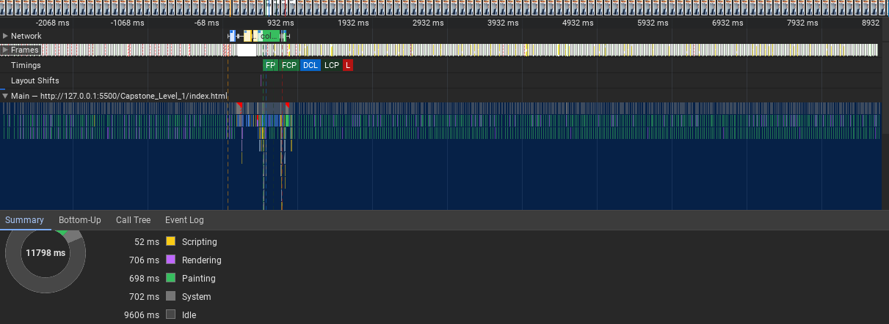
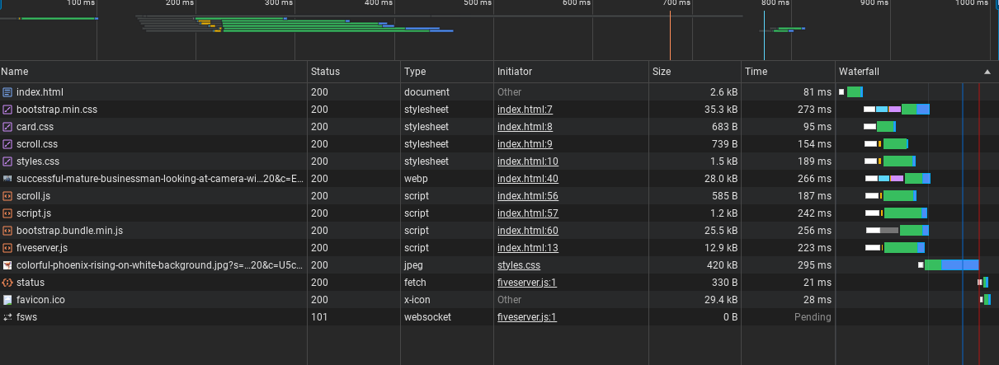

I used the home page (index.html) for this assignment

<script src="image.png">Lighthouse report<script>

running the lighthouse report showed scores above 90

<script src="image-2.png">Performance report<script>

performance appears very good for the content on the page

<script src="image-1.png">Network report<script>

network report looked good, there is not a lot of content on the home page 

